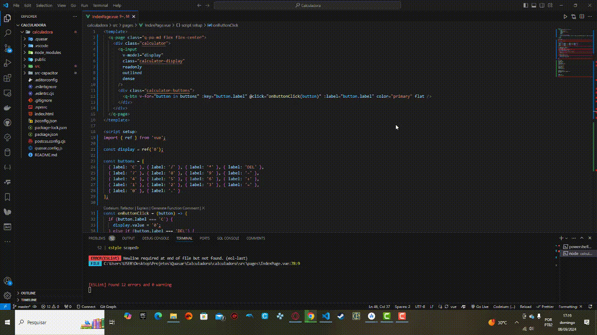

# Quasar App (calculadora)

Calculadora

## Tecnologias utilizadas 💻
<ul>
  <li>HTML5</li>
  <li>CSS3</li>
  <li>Javascript</li>
  <li>Vue3 composition</li>
  <li>Quasar</li>
</ul>

## Install the dependencies
```bash
npm install
```

### Start the app in development mode (hot-code reloading, error reporting, etc.)
```bash
npm run dev
```


### Lint the files
```bash
npm run lint
```

### Para buildar para android
```
quasar mode add capacitor
quasar dev -m capacitor -T android
```

### Para buildar para ios
```
quasar mode add capacitor
quasar dev -m capacitor -T ios
```

### Build the app for production
```bash
quasar build
```

### Customize the configuration
See [Configuring quasar.config.js](https://v2.quasar.dev/quasar-cli-vite/quasar-config-js).


# Screenshot


